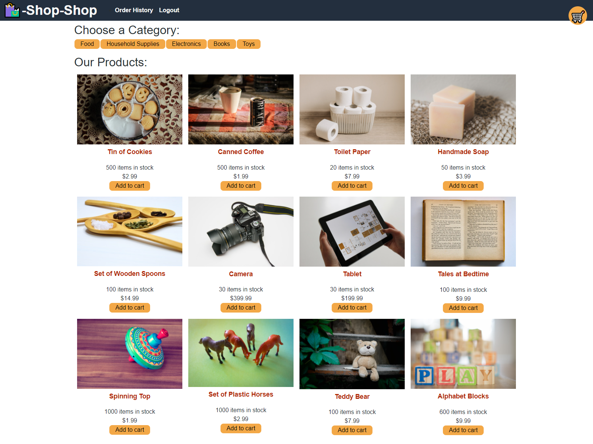

# Redux Store

## Description
Redux Store is a MERN stack e-commerce shop built with React-Redux and Stripe API.
            
View the deployed page at [Redux Store]().

## Contents
* [Installation](#Installation)
* [Usage](#Usage)
   * [Screenshots](#Screenshots)
* [Questions](#Questions)
* [Credits](#Credits)

## Installation
To initiate this application, simply clone the repository and run `npm i` from the command line.  Run `npm start` from the root of the application to start the application.

## Usage
To test the deployed application, you may log in using the email `test@test.com` and the password `password`.  Items can be added to the cart via the main page or product detail page.  Users can also update or remove items from their cart.  To test the checkout feature, use the credit card number `4242 4242 4242 4242` along with any other mock data.
    
### Screenshots

## Questions
If you have any questions about the repo, please [open an issue](https://github.com/AM-Cowles/redux-store/issues) or contact me via email at alyssa.m.cowles@gmail.com. You can find more of my work on my GitHub, [AM-Cowles](https://github.com/AM-Cowles).
    
## Credits
* Refactored by Alyssa Cowles.